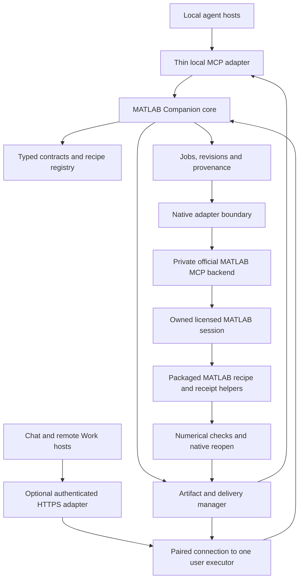

# MATLAB Companion: architecture and implementation plan

Date: 2026-09-15
Status: **Approved design snapshot; implementation started on 2026-09-15**
Shared baseline: **Chembridge 2026-09-14.1**
Working identity: **MATLAB Companion**, an independent Chembridge plugin; no MathWorks or University of Edinburgh endorsement is implied.

## 1. Decision

Build one natural-language MATLAB plugin with a host-neutral workflow core, thin host adapters and a licensed, user-owned MATLAB executor. Prioritise the existing **official MathWorks MATLAB MCP Server** as the native execution backend. Add the Chembridge responsibilities around it: small scientific recipes, typed results, bounded jobs, reproducibility, native artifact verification, ordinary-user setup and actual delivery to each host.

This is a design decision with an explicit feasibility gate: select and pin the official backend after phase 0 demonstrates ownership, machine-readable receipts, file readback and interruption behaviour. Retain MATLAB Engine for Python as a replacement adapter if a documented critical gap justifies it. Do not implement or install two native backends by default.

The first vertical workflow is **selected numerical data → documented analysis → editable MATLAB files and figures → verified delivery**. General MATLAB programming, toolboxes and Simulink are subsequent increments of the same product. No additional paid reasoning service is needed: the user's chosen agent handles language; MATLAB performs the scientific computation.

This plan follows [shared principles](../DEVELOPMENT_PRINCIPLES.md), [cloud development](https://github.com/saigyujikingyo-png/chembridge/blob/codex/chembridge-cloud/CLOUD_DEVELOPMENT.md), [storage policy](https://github.com/saigyujikingyo-png/chembridge/blob/codex/chembridge-cloud/CLOUD_STORAGE.md), [project catalog](https://github.com/saigyujikingyo-png/chembridge/blob/codex/chembridge-cloud/project-catalog.json), [new-plugin checklist](https://github.com/saigyujikingyo-png/chembridge/blob/codex/chembridge-cloud/templates/NEW_PLUGIN.md) and [contributor template](https://github.com/saigyujikingyo-png/chembridge/blob/codex/chembridge-cloud/templates/AGENTS.md). The existing Mnova plan informed document organisation only; no product implementation or acceptance is inherited.

### Current evidence ledger

| Area | State | Evidence and practical limit |
| --- | --- | --- |
| Shared rules and architecture | READY | Required entrypoints read; decisions, interfaces, phases and gates documented here. READY applies to planning. |
| Official execution interfaces | PARTIAL | Public documentation and selected upstream source reviewed; no installed MCP or Engine invocation performed. |
| Current development device | PARTIAL | Read-only PATH/uninstall lookup finds MATLAB R2026a. `VersionInfo.xml` says Update 5, `26.1.0.3346908`; launcher metadata says `26.1.0.3299496`. Runtime `version`, activation and toolbox availability remain unverified. |
| University applicability | PARTIAL | Public MATLAB access and teaching sources identified; exact account entitlement and course instructions require their own checks. |
| Product code, executable schemas and packaging | NOT STARTED | This task creates planning documentation only. |
| Product repository and cloud environment | NOT CREATED | Proposed names below are not existing-resource claims. |
| Native, numerical, installation, host/model and delivery acceptance | NOT RUN | Separate future evidence is required for each gate. |
| Blocking planning issues | NONE | Native unknowns have named phase-0 tests and fallback decisions. |

## 2. Evidence and backend selection

External sources were consulted on 2026-09-15. Vendor documentation describes capabilities; it does not establish working behaviour on this device or acceptance by any agent host.

| Finding | Official source | Consequence for this design |
| --- | --- | --- |
| MathWorks maintains MATLAB MCP Server; the old `matlab-mcp-core-server` repository redirects to it. Its README lists MATLAB R2021a or later, code evaluation, file execution, code checks and test execution. | [Official repository](https://github.com/matlab/matlab-mcp-server) | Reuse the native bridge where feasible. Upstream supported versions are not the Companion compatibility matrix. |
| The backend has explicit new/existing session modes; its default automatic mode can attach to a previously shared session. | [Session configuration](https://github.com/matlab/matlab-mcp-server#arguments) | The proposed local preview explicitly selects a new owned session. Existing-session work gets a later ownership gate. |
| Upstream has its own licence, including use in connection with MathWorks products; the README disallows multi-user server sharing. | [Upstream licence](https://github.com/matlab/matlab-mcp-server/blob/main/LICENSE.md), [usage terms](https://github.com/matlab/matlab-mcp-server#licensing-and-usage) | Keep original Companion source separately licensed. Preserve dependency notices. Remote design uses a private executor per user and must verify applicable account/licence conditions. |
| Python Engine is a supported local MATLAB interface with release-specific Python compatibility. Python 3.12 is listed for R2024b, R2025a/b and R2026a. | [Python compatibility](https://www.mathworks.com/support/requirements/python-compatibility.html), [Engine overview](https://www.mathworks.com/help/matlab/matlab-engine-for-python.html) | Python 3.12 is a reasonable core baseline. An Engine fallback needs a matching pinned native package, not an unbounded latest install. |
| Engine cannot connect directly to a MATLAB installation on another computer, and transferred arrays have size limitations. | [Engine limitations](https://www.mathworks.com/help/matlab/matlab_external/limitations-to-the-matlab-engine-for-python.html) | A remote host needs a device connection to an executor, regardless of the selected backend. Keep large arrays in files on that executor. |
| MATLAB provides command-line batch execution and separate compiled-application deployment. | [Windows command line](https://www.mathworks.com/help/matlab/ref/matlabwindows.html), [MATLAB Runtime](https://www.mathworks.com/products/compiler/matlab-runtime.html) | CLI batch is a possible diagnostic/reproducibility runner. Runtime is not a substitute for a licensed, general-purpose MATLAB session. |
| Native MAT and FIG loading may execute contained code. | [MAT-file loading](https://www.mathworks.com/help/matlab/ref/load.html), [FIG opening](https://www.mathworks.com/help/matlab/ref/openfig.html) | Trust and execution scope apply to native inputs as well as scripts. A file extension or metadata scan does not make an arbitrary file safe. |
| Live scripts support native formats, and converting an ordinary script requires a supported conversion rather than changing its extension. | [Creating live scripts](https://www.mathworks.com/help/matlab/matlab_prog/create-live-scripts.html), [Live Code formats](https://www.mathworks.com/help/matlab/matlab_prog/what-is-a-live-script-or-function.html) | Deliver ordinary `.m` first. Treat Live Code `.m` and `.mlx` as distinct capability gates, preserving native editability. |

The inspected release is [v0.13.0](https://github.com/matlab/matlab-mcp-server/releases/tag/v0.13.0). Its evaluation tool uses an unstructured-output implementation whose `OutputSchema` is nil; its converter can return PNG content. This is an observed upstream contract gap, not a claim that the backend cannot generate images. Companion must implement its own validated public contracts and native-file delivery. [Unstructured-output implementation](https://github.com/matlab/matlab-mcp-server/blob/v0.13.0/internal/adaptors/mcp/tools/basetool/withunstructuredcontent.go), [image conversion](https://github.com/matlab/matlab-mcp-server/blob/v0.13.0/internal/adaptors/mcp/tools/utils/responseconverter/responseconverter.go)

The inspected custom-tool interface accepts scalar arguments and returns command-window output. The request-ID/receipt mechanism in section 4 is a proposed Companion extension, not an existing upstream feature. [Versioned custom-tool guide](https://github.com/matlab/matlab-mcp-server/blob/v0.13.0/guides/custom-tools.md)

### Alternatives and decisions

| Route | Position | Feasibility/release gate |
| --- | --- | --- |
| Official MCP backend plus Companion core | Preferred | Pin upstream release/checksum; invoke a trusted packaged MATLAB helper; validate receipts; prove owned sessions and recovery. No upstream fork by default. |
| Official custom-tool extension only | Useful internal entrypoint, insufficient as the whole product | Verify the selected extension interface. Companion still supplies end-to-end contracts, workflows, jobs and delivery. |
| MATLAB Engine for Python | Replacement when justified | Demonstrate the specific upstream limitation, matching package/runtime, native function calls, async behaviour and artifact equivalence. Record migration under the same public contracts. |
| `matlab -batch` | Optional one-shot runner | Distinguish this command-line option from the toolbox `batch` API. Verify quoting, process exit, graphics, timeout and receipts; do not silently replay a timed-out write through it. |
| MATLAB Online | Future separate backend or manual file compatibility | Verify the actual supported integration and account. Do not infer an automation API from browser access. |
| Compiler / Runtime / Production Server | Later specialised deployment, if justified | Separate product licences, deployment restrictions and fixed-function semantics; not a default dependency. |
| GUI automation | Setup or explicitly labelled assisted route | Supported APIs remain the primary scientific route. GUI success cannot count as unattended API acceptance. |

**Decision rule:** keep the preferred route if all required phase-0 capabilities pass. A failed optional feature becomes an unsupported capability. A failed essential ownership/receipt gate triggers a bounded Engine comparison. If neither route meets the essential gate, stop native implementation expansion and report the blocker; portable tests cannot resolve it.

## 3. User experience and functional scope

### First usable Windows preview

Users install the package, connect an agent, choose input files and ask for work. No Git checkout, coding project, terminal, manually installed Python or edited JSON is required for ordinary use. The installer and workflow are planned until separately demonstrated.

| Request | First-release behaviour | Required outputs |
| --- | --- | --- |
| “Inspect this data and plot absorbance against concentration.” | Read selected CSV/TSV or trusted numeric MAT input; detect columns, missing values and declared units; preserve the input; create a documented plot. | Input manifest, editable `.m`, `.mat`, `.fig`, preview and exported table. |
| “Make a linear calibration and report the residuals.” | Explicit x/y selection, intercept policy, weights and fitting range; rank/data checks; calculate in MATLAB. | Coefficients with units, residuals, method/uncertainty status, native figure and reproducible script. |
| “Simulate this first-order reaction and compare it with the observations.” | A versioned first-order kinetic model, stated initial condition and rate unit, finite time grid and documented solver settings. | Trajectory, observed-versus-simulated plot, parameters and solver record; no invented measurements. |
| “Change the axis limits and legend, keeping the fit unchanged.” | Create a new revision from an owned artifact manifest; edit only identified objects; retain previous results. | New `.fig`/exports, unchanged numerical result evidence and a revision receipt. |
| “Give me files I can continue editing in MATLAB.” | Save, close and reopen owned native files; rerun a reproducible script on the declared release; then transfer through the selected host. | Native bundle plus readback and delivery evidence. |

Base MATLAB is the intended dependency for these recipes. Candidate functions include table import, linear algebra, plotting and ODE solvers; each chosen function, release and actual entitlement must be checked during implementation. Optional toolbox functions are never silently substituted for an unavailable base recipe. An unknown unit or ambiguous column mapping prompts a focused clarification while independent inspection continues.

### Capability increments

| Increment | Scope | Additional gate |
| --- | --- | --- |
| Scoped MATLAB programming | Generate/edit a selected `.m` revision, run static checks, execute trusted user code and MATLAB tests; return changes and diagnostics. | Explicit code-execution scope, source hashes, ownership, dependencies, side-effect boundaries and reproducibility. Static checks alone do not establish safety or correctness. |
| Live Editor | Plain-text Live Code and `.mlx` reports with code, explanations and computed outputs. | Supported format/conversion on the selected release; native reopen and content/output fidelity. No undocumented internal APIs in the stable path. |
| Scientific toolboxes | Nonlinear fitting, statistics, optimisation, signal processing, symbolic work, image analysis or requested chemistry workflows. | Per-operation toolbox/version/permission map, appropriate numerical fixtures and uncertainty. |
| Simulink | Inspect and simulate user-selected models; later bounded block/parameter revisions. | Simulink licence, referenced models/data dictionaries, callbacks, solver/sample times, `.slx` reopen and numerical equivalence. |
| Large/batch/parallel work | Selected small batches first; later GPU, parallel pools or licensed compute services. | Resource estimates, explicit execution destination, partial results, cancellation, actual entitlement and no unexpected paid compute. |
| Existing desktop session | Continue work on explicitly selected user variables/figures. | Named session identity, save/unsaved-state handling, stale revision checks, non-interference and safe disconnect. |
| More systems | macOS/Linux and further MATLAB builds. | Separate package/native/host records. No permanent product fork by OS, host, model or minor MATLAB release. |

Instrument control, acquisition and shared research database writes require their own requested capability increment. Course-platform operation and autonomous submission are outside the current scope; any future evaluation must satisfy the applicable institution, course and platform rules as well as user authorisation. No universal Edinburgh report format is assumed.

## 4. Components and execution flow



The Engine replacement, if selected after phase 0, occupies the same native-adapter boundary and calls the same MATLAB helpers. It is not a second scientific implementation.

### Core and dependencies

- External Python 3.12, bundled for end users; official MCP Python SDK plus shared typed definitions using its compatible validation dependencies. Pin versions and lock dependencies in the product repository. [Official SDK](https://github.com/modelcontextprotocol/python-sdk)
- Reuse standard-library paths, hashing, atomic manifests and bounded job journals. No central database, workflow platform or additional inference backend for the first release.
- Native MATLAB helpers own scientific calculation and native file generation; the core owns policy, operation dispatch, schema validation, job identity and delivery. Helpers do not call another model.
- Keep native dependencies behind the adapter so cloud portable tests run without MATLAB or an installed native MCP binary. Bundle/acquire only the backend selected for the package, with its notices and verified checksum.
- Use one installed per-user coordinator with a lock across host connections, started on demand and stopped after an idle period. Thin stdio launchers connect through a user-restricted local IPC endpoint. A process per host must not independently mutate the same revision or consume unbounded MATLAB sessions.

### Proposed native boundary

Internal adapter methods are `probe`, `start_owned_session`, `submit_request`, `observe_job`, `request_cancel`, `collect_receipt`, `verify_native` and `close_owned_session`. These are design identifiers, not invented vendor APIs.

1. Stage selected inputs and a typed request in a local job directory. Generate a job ID, revision ID and immutable input manifest before any calculation.
2. Dispatch a fixed packaged MATLAB entrypoint with a validated opaque request ID. Complex arrays and parameters stay in the request/file payload; do not build MATLAB source by interpolating user expressions or paths.
3. Prefer a private custom-tool entrypoint if supported by the pinned official backend. Otherwise use its supported file runner on a core-generated, immutable launcher that invokes the same helper. Only the core can select that launcher.
4. The helper validates the request, computes, writes native artifacts to staging and records the actual methods, diagnostics and phase. It writes an atomic completion receipt containing the request/input hashes and result metadata.
5. The core validates the receipt, operation result and artifact existence, sizes and hashes. It promotes a new immutable revision only after the operation's required checks pass.
6. Delivery runs afterwards and records its own state. A delivery retry must never rerun a successful calculation.

Do not parse scientific results out of human console prose. Treat upstream text/images as diagnostics or previews. The formal result comes from the validated receipt and files. Custom-tool input/output limitations and stdout/stderr handling are part of phase 0; a backend `ok` response alone cannot establish completion.

Start MATLAB with an explicit installation root, new owned session and task working directory. Keep desktop display configurable; setup and native visual acceptance may need visible windows. Prevent default attachment to an unrelated existing session. Inspect startup/path behaviour and function resolution, including user `startup.m`, shadowed names and add-ons; a new process is workspace isolation, not a security sandbox.

## 5. Public tool surface and structured contracts

Use six short public tools. Detailed operation help, schema documents and large result tables are discoverable on demand. Public names below are proposed, not installed tools.

| Tool | Main inputs | Structured result |
| --- | --- | --- |
| `matlab_status` | Optional executor/capability query; explicit native self-test mode | Installation observations, session state, capability reasons and verification timestamps; no launch implied by a passive status request. |
| `matlab_help` | Operation/topic/schema version, cursor | Bounded operation descriptions, required inputs, output semantics and versioned schema resource references. |
| `matlab_inspect` | Authorised input/artifact IDs, requested metadata, cursor | Format, trust classification, columns/variables/shapes/units and missing-data summary; native inspection is queued if required. |
| `matlab_run` | Operation ID, typed arguments, input IDs, expected revision and idempotency key | Validated acceptance or error with stable job ID; native work completes asynchronously. |
| `matlab_job` | Job ID; `status`, `cancel` or `reconcile` | Lifecycle, bounded progress, operation-specific validated summary, result reference and recovery information. |
| `matlab_artifacts` | Job/artifact IDs; `list`, `read` or `deliver`; authorised destination reference | Artifact metadata, pagination/media blocks and an independent delivery receipt. |

`matlab_run` dispatch initially registers `data_profile`, `plot_xy`, `linear_calibration`, `first_order_kinetics` and `revise_figure`. Future `code_check`, `code_run`, `code_test` and toolbox operations receive their own input/output definitions before exposure. Inspection and artifact dispatch routes are also covered by the registry; a single generic tool does not remove their validation requirement.

### Contract shape and semantics

Every public tool declares a meaningful `outputSchema` and emits matching `structuredContent`; validation occurs server-side. MCP schema support and structured content are documented in the [tool specification](https://modelcontextprotocol.io/specification/2025-11-25/server/tools). Companion also validates the selected operation's result from a versioned registry before it can enter a tool response or result resource.

| Contract element | Proposed semantics |
| --- | --- |
| Identity | Required `contract_version`, `request_id`, `operation`, `observed_at`; `job_id` required once work is accepted, even after errors. IDs are opaque and principal-scoped. |
| State | Enumerated lifecycle; separate `execution_state`, `verification_state` and `delivery_state`. A computed result can be undelivered or fail native readback. |
| Result | Tool-specific bounded fields; operation ID and result-schema version select the additional semantic validator. Summaries contain typed quantities, diagnostics and artifact references, not unconstrained arbitrary JSON. |
| Scientific quantity | Name, numeric value when available, unit, availability state and method. Missing/unsupported/not-calculated is explicit; null is not zero. Uncertainty includes kind, confidence level when applicable and calculation method. |
| Large arrays | Artifact reference plus class, dimensions, real/complex, sparse/dense and missing/non-finite counts. MAT/HDF5-backed data stay outside model text; preserve values and precision. |
| Provenance | Input hashes, recipe/version, parameters, MATLAB/toolbox versions, random generator/seed when used, source revision, actual warnings and timestamps. Record unavailable observations honestly. |
| Artifact | ID, revision, role, filename, media type, bytes, SHA-256 after hashing, format/version and separate generation/reopen/delivery evidence. No local absolute path leaked to a remote host. |
| Pagination | Bounded page size, returned count, optional known total and opaque next cursor; no misleading empty success when a read failed. |
| Error | Stable code, stage, recoverability, bounded recovery actions, known job ID and side-effect certainty; no secret-bearing raw stack trace. |

Use a compact common job summary with typed scalar/quantity lists and result-resource metadata. Full operation-specific results are validated against their own schema and returned through a referenced JSON resource when they exceed the summary budget; hosts without resource support can retrieve bounded result pages through the artifact tool. This keeps the default catalog small without using an unconstrained `data: object` as the result contract.

Root schemas are objects; required fields, bounds, enum values, optional/null rules and supported JSON Schema dialect are explicit. Business validators reject impossible states, non-finite JSON numbers, wrong array shapes and mismatched units. Missing units remain unknown until supplied; the server does not invent them to satisfy validation. No numeric casting of string values merely to pass a schema.

Return an equivalent serialised JSON text fallback for hosts that need it. Preserve media in MCP image/resource blocks; do not duplicate base64 arrays or binaries inside structured JSON. Keep field meanings stable across hosts. Version incompatible changes and test all advertised direct/dispatcher and fallback routes.

### Failure and lifecycle behaviour

Normal work progresses through `queued → running → verifying → completed`. Additional states include `awaiting_user`, `cancel_requested`, `cancelled`, `failed`, `interrupted` and `outcome_unknown`.

- Domain/input/native failures return a schema-valid error and consistent MCP `isError: true`. Protocol-level malformed requests remain protocol errors. A passive query that successfully reports a failed job is itself a successful query; job failure remains explicit in its payload.
- Accepted, pending and cooperative cancellation requests are not failures. A cancellation acknowledgement is not evidence that MATLAB has stopped. Mark `cancelled` only after the executor confirms quiescence and the receipt describes partial outputs.
- A timeout/disconnect after dispatch becomes `outcome_unknown` until reconciliation. Preserve the job ID and look for the owned process/receipt before any repeat. Never repair a malformed output by repeating the calculation.
- `OUTPUT_CONTRACT_INVALID` quarantines the invalid payload but retains the job and side-effect evidence. It cannot be relabelled successful because a file exists.
- Initial error families: `INPUT_INVALID`, `INPUT_UNTRUSTED`, `REVISION_CONFLICT`, `MATLAB_NOT_FOUND`, `LICENSE_UNAVAILABLE`, `CAPABILITY_UNSUPPORTED`, `QUEUE_FULL`, `NATIVE_EXECUTION_FAILED`, `OUTPUT_CONTRACT_INVALID`, `NATIVE_VERIFY_FAILED`, `OUTCOME_UNKNOWN` and `DELIVERY_FAILED`.

Maintain a per-tool/per-operation ledger for declaration, runtime validation, success/error/pending/cancel branches, missing/null fields, native result validation, media/fallback compatibility and real-host calls. All entries begin **not implemented / not verified** in this plan.

## 6. Scientific results, native artifacts and continued editing

### Methods and numerical checks

- Preserve raw inputs byte-for-byte. Record column mappings, unit declarations/conversions, missing/non-finite values, inclusion/exclusion rules and transformations. Do not silently drop rows or change scientific units to make a fit succeed.
- Linear calibration records model, intercept constraint, x/y roles, fit range, weighting interpretation, coefficient units, residuals, rank and degrees of freedom. Positive weights are required. Propagating known measurement uncertainties differs from estimating residual variance; the selected method must say which it uses. Do not assume that x has negligible uncertainty when the user reports otherwise.
- Report standard errors or confidence intervals only when the selected model, degrees of freedom and method support them. Otherwise return a reason such as insufficient residual degrees of freedom. Residuals and method suitability matter alongside goodness-of-fit summaries; a large R-squared does not validate a model.
- First-order kinetics records rate/time units, initial concentration, solver, relative/absolute tolerances and time domain. Distinguish simulated trajectories, observed data and fitted parameters. More complex mechanisms require separate identifiability and numerical gates.
- Any stochastic method records generator and seed. Preserve double/complex/sparse data where supported; large or unsupported objects become explicit capability results, not lossy JSON conversions.
- Use predeclared, scale-aware tolerances and a small independent analytical oracle: known linear coefficients and the first-order exponential solution. The independent check is a test oracle, not a second user-facing scientific execution backend.

### Deliverable bundle

| Artifact | Role | Verification before making the relevant claim |
| --- | --- | --- |
| Original selected inputs + manifest | Provenance and reproducibility | Compare original and staged sizes/hashes; include originals in a delivered bundle only within the user's authorised data scope. |
| Ordinary `.m` | Editable analysis, comments, parameters and reproduction | Read back source and run against staged inputs in a clean owned session without the plugin's private paths on the declared release. Output paths remain relative/configurable. |
| `.mat` | Native numerical arrays and method metadata | Native reload into an owned scope; compare variable names, classes, shapes, units and values with declared tolerances. |
| `.fig` | Editable MATLAB graphics | Reopen in MATLAB, check axes, curves, data, labels, units and object identity; perform a bounded subsequent edit. |
| PNG and PDF | Inline review and shareable figure | Inspect rendering, labels, cropping and data correspondence. Export success alone is insufficient. |
| CSV | Portable numerical tables | Check row counts, column meanings, precision and unit metadata. |
| Method report + machine-readable receipt | Explain what ran and what was verified | Record actual inputs, settings, software, limitations and separate verification/delivery states. |
| Optional `.mlx` / Live Code `.m` | Interactive narrative report | Verify supported creation/conversion, original content, rendered outputs and native editability on the selected build. |

MATLAB supplies [native saving](https://www.mathworks.com/help/matlab/ref/save.html), [figure saving](https://www.mathworks.com/help/matlab/ref/savefig.html) and [graphics export](https://www.mathworks.com/help/matlab/ref/exportgraphics.html). Their presence is not evidence that the planned bundle already exists.

There is no single MATLAB document that necessarily preserves an entire working project. The manifest ties scripts, data and figures together, records relative dependencies and excludes absolute private device paths. Hashes prove byte identity during transfer; reopened results and numerical comparisons prove different properties. A freshly regenerated MAT/FIG file need not have the same hash to be numerically equivalent.

Delivered scripts must run independently of the installed Companion runtime. Inline the small required analysis logic or include necessary original helper files in the delivered manifest with an explicit entrypoint and software dependencies. Reproduction acceptance must not accidentally succeed because a private plugin helper directory remains on MATLAB's path.

For continued editing, start from an immutable Companion revision and stable figure/object IDs stored in the manifest. Require the expected revision; clone the owned figure and change selected properties. Compare untouched data and fit results, preserve earlier artifacts and reject stale edits. A label change that implies a unit conversion must also transform the plotted values or request clarification. Unknown third-party FIG callbacks or unsupported objects prevent an unqualified preservation claim.

## 7. Ownership, recovery and execution boundaries

### Files and jobs

- Store active runtime, queues, locks, requests and jobs in a per-user local application-data directory outside cloud sync. Output uses the user's chosen authorised folder or host attachments. OneDrive is optional storage/archive, not a runtime requirement.
- Authorise selected roots and file IDs; resolve symlinks, reparse points, relative traversal and archive expansion against those roots. Stage only requested files and declared dependencies. Dataset limits produce a clear error before execution rather than silent truncation.
- Bind idempotency to user/executor, operation, input hashes, recipe version, parameters and expected revision. Reusing a key with different content returns a conflict. A duplicate accepted request returns the same job; it does not consume another MATLAB execution.
- Journal intent before dispatch, then record phases and an atomic completion receipt. Preserve intermediate outputs after uncertain execution for reconciliation. Never claim exactly-once execution across arbitrary process failure; use deduplication and explicit uncertainty.
- One writer per owned MATLAB session; initially one session and a bounded queue. Different host connections share that lock. Validate output destinations before committing; do not overwrite existing user outputs by default.
- Recovery checks the executor/session identity, receipt, input/request hash and generated artifacts. Late receipts are attached to their original job. Failed verification retains diagnostic artifacts as unverified, not delivered as verified success.

### Trust and code execution

Packaged recipes take validated data and enumerated choices. No arbitrary MATLAB expression, shell command, path or toolbox name is accepted as an executable recipe parameter. Product-controlled helpers must not recursively add arbitrary input directories to MATLAB's search path.

Trusted native input means user-selected provenance whose opening/execution is within the authorised task scope, or a verified plugin-created artifact. Untrusted MAT/FIG/code does not become trusted because it passed a static scan. The first preview can inspect ordinary tabular files and decline native loading outside its trust scope.

Scoped programming is an explicit product capability, not a hidden escape hatch in a recipe argument. A request to run/edit the user's code can establish that scope; do not require repeated approval for routine work already covered by it. Bind execution to the selected source revision and explain external effects when they are material. Ordinary generated scripts use reviewed templates first; arbitrary code can access MATLAB's filesystem, network, Java/.NET or native extensions, so a working directory and an allowlist are not a sandbox. Untrusted arbitrary execution stays unavailable unless a suitable OS isolation boundary and licence-compatible setup have been demonstrated. No heavyweight sandbox service is a default dependency for trusted recipes.

Preserve existing workspace, figures, preferences and path configuration. Do not automatically edit `startup.m`, attach to the latest shared session or close all MATLAB processes. Account login, MFA and vendor activation are handled by the owner through the official interface. Reuse valid encrypted connection settings and request action only after observing a missing/invalid permission.

### Timeouts and cancellation

The inspected upstream client uses request context cancellation, but this is not a documented guarantee that MATLAB computation stops. [Inspected client implementation](https://github.com/matlab/matlab-mcp-server/blob/v0.13.0/internal/adaptors/matlabmanager/matlabsessionclient/embeddedconnector/client.go)

Implement cooperative checks between recipe steps and wherever a supported solver callback allows them. A running native call may remain `cancel_requested` until it reaches a safe boundary. If the session becomes unresponsive, only an explicitly identified plugin-owned process may enter a tested termination/recovery route; record partial/unknown outputs. Never terminate a user's pre-existing MATLAB process. Engine's optional [FutureResult cancellation](https://www.mathworks.com/help/matlab/apiref/matlab.engine.futureresult.cancel.html) would require its own observed success check rather than assuming cancellation from a timeout.

The core writes a job-scoped cancellation flag through a local control path independent of the serial MATLAB call queue; a helper checks that flag at safe boundaries. Queuing another evaluation behind a busy MATLAB call is not prompt cancellation. After forced termination, the core produces the recovery record from observed process/artifact evidence; it cannot rely on the terminated helper to emit a final receipt.

## 8. Host connections, university access and installation

### Host adapters and original-file delivery

Local-capable hosts connect through stdio to the same user core. Remote-capable hosts use an optional authenticated Streamable HTTP gateway and a paired outbound connection to the licensed executor; remote mode is enabled only when requested. Use MCP-compatible OAuth discovery where the host requires it, short-lived audience-bound tokens, user/device scope, revocation and bounded transfer retention. Never expose the underlying evaluator as an unauthenticated network service. [MCP transports](https://modelcontextprotocol.io/specification/2025-11-25/basic/transports), [HTTP authorisation](https://modelcontextprotocol.io/specification/2025-11-25/basic/authorization)

The gateway transports authorised jobs and files; it contains no duplicated scientific logic, campus credential store or shared MATLAB pool. Each user's executor and data are separate. Verify the applicable licensing and hosting terms before enabling any remote deployment; per-user isolation is a design boundary, not blanket vendor permission. No automatic public tunnel or paid hosting service is provisioned by default.

| Surface | Intended route | Acceptance status |
| --- | --- | --- |
| Codex local | Local MCP plus projectless natural-language use | Not tested for this plugin |
| Claude local-capable clients | Local MCP/package adapter | Not tested for this plugin |
| ChatGPT Chat | Account-supported connector and remote device route | Capability/account access and file delivery unverified |
| ChatGPT local Work | Actual available local or connector route | Separate acceptance; confirmed project-sync frontend bug remains out of scope |
| ChatGPT cloud Work | Remote device route and receiving-workspace file adapter | Separate model, network, attachment and readback gates |
| WorkBuddy and other agents | Their supported MCP/auth/file adapter | Discover capabilities and test before advertising support |

A resource URI or local Windows path is not a received file. Inspect the receiving host's file contract, transfer the original bytes, materialise them in the receiving workspace when required, compare size/SHA-256, pass only an accepted path/reference, and read back destination metadata or bytes where available. Preserve original bytes and filenames; do not reconstruct native files from model text. A valid MCP binary resource is not automatically a connector attachment reference.

Track generated, natively verified, transfer attempted, received and read-back-verified states independently. A manual download may validate that route when automatic download is not required, with its user steps counted. An adapter unable to attach binaries reports that limitation explicitly; a text-only host can still explain results and provide an authorised usable download route.

### Edinburgh applicability

Use the [University MATLAB entrypoint](https://information-services.ed.ac.uk/computing/desktop-personal/software/main-software-deals/matlab), [public campus licence overview](https://information-services.ed.ac.uk/sites/default/files/atoms/files/university_of_edinburgh_matlab_software.pdf) and [Engineering MATLAB teaching site](https://www.matlab.eng.ed.ac.uk/) as discovery sources. The university access page was available through its official search index but direct access returned HTTP 403 during research; no account or current individual entitlement was checked. The overview cannot establish every toolbox, off-device execution or shared-service right.

The chosen calibration, kinetics and plotting examples are product design choices consistent with [MathWorks chemistry workflows](https://uk.mathworks.com/solutions/chemistry.html). They are not claims that a particular current Edinburgh course mandates MATLAB. Obtain the applicable course/lab method, format and AI-use rules before making such a claim. Old course descriptions must not substitute for current requirements. The plugin does not need access to private Learn content or a university OneDrive login for routine MATLAB operation.

The [university student AI guidance](https://information-services.ed.ac.uk/computing/comms-and-collab/elm/generative-ai-guidance-for-students/using-generative) is an additional requirements source for assessed work and platform use. Research could read its official search index while direct access returned HTTP 403. Recheck the actual current course/platform conditions for any future such integration; this plan establishes no private-account or assessment permission.

### Package and setup

- Proposed first package: Windows x64, bundled Python core, locked dependencies, packaged `.m` helpers, host setup and a verified official backend acquired/reused by the installer. Whether to redistribute the upstream binary inside the package or fetch it during setup is settled against its pinned licence and offline-install needs in phase 0. Preserve all required notices.
- Original Companion source uses a proposed MIT licence; third-party licences remain separate. Do not describe the vendor backend as MIT or distribute MATLAB, licence files, private courses or vendor runtimes inside the open-source source tree/cloud container.
- Detect existing MATLAB installations and choose the user's supported one; do not silently upgrade MATLAB. Report installation, activation, installed products, successfully exercised capabilities and accepted workflows separately. A toolbox listing alone does not demonstrate successful checkout/use.
- Provide connection status, self-test, reconnect, diagnostics, update, rollback and removal through understandable UI. Configure only the plugin's named host entry, back up affected settings and preserve unrelated connections. Use platform-protected credential storage.
- Start locally on demand. Disable optional backend telemetry in the Companion launch profile using the supported upstream option; make diagnostics bounded and exclude secrets/private data. Remote mode explains the destination before transferring data.
- Release through GitHub Releases with English README/install/usage/recovery guidance, explicit versions, package checksums, dependency notices, known issues and compatibility. Keep one usable rollback version. Signature/OS-warning and graphical setup limitations remain visible until tested.

## 9. Performance and model evaluation

These are initial engineering targets, not measured results. Adjust them only with recorded device, workload and package evidence.

| Measure | Initial target/bound |
| --- | --- |
| Tool discovery | Six concise tools; detailed operation schemas/guidance on demand |
| Warm passive status/job acceptance | p95 under 2 seconds on the recorded acceptance device |
| Native startup | Measure separately from warm calls; show starting state and a configurable deadline |
| Small analysis workflow | Initial 120-second deadline after startup; distinguish computing, verifying and delivering; calibrate against fixtures |
| Native concurrency/queue | One owned session/writer; queue of at most 10 requests, explicit queue-full result |
| Tables/model-visible results | Default 50 rows, bounded preview/diagnostics; arrays via artifacts |
| Polling | Suggested 1-second initial delay, back off to 5 seconds or longer; use notifications when actually supported |
| Storage/transfers | Initial per-job staged-input cap 256 MiB for the small-data preview; configurable checked output quota; reject excess before work where possible |
| Retention | Proposed seven-day retention for delivered temporary jobs; preserve active/uncertain jobs, undelivered native outputs and user outputs; show configurable cleanup and disk use |
| Package/memory | Measure full package bytes, cold/warm startup, idle/peak memory, MATLAB session cost, input/output/transfer bytes; set regression bounds from the first accepted package |

The 256 MiB bound is a Companion engineering choice, not a MATLAB vendor limit. Larger data support is a later measured increment. Execution completion alone does not trigger cleanup of outputs whose delivery failed or remains unconfirmed; retain a retransmission copy under a visible retention policy, and notify the user before any necessary expiry. Optional cold archives follow the Chembridge storage policy; cleanup never deletes user-delivered files or assumes cloud sync proves a recoverable archive.

Use **GPT-5.6 Terra with max reasoning** as the benchmark when the actual host offers it. Also target suitable DeepSeek, Gemini, GLM and Kimi configurations through the same operations, and ELM when applicable and available, without a new paid model dependency. No compatibility or performance claim is inferred from a model name.

Record exact host/account surface, model/effort, plugin/backend/MATLAB/toolbox versions, device category, date, common inputs, first-attempt success, human corrections, calls/retries, end-to-end time, artifact quality and actual available token/charge information. Missing usage is unavailable; schema bytes or estimated tokens are not billing evidence. Record the actual substitute if Terra max is absent, without relabelling it a Terra benchmark.

The common case set covers successful analysis, a follow-up edit, missing units, malformed arguments, unsupported capability, native timeout, failed readback and delivery recovery. Compare the preferred backend with a replacement only if phase 0 justifies that engineering cost.

## 10. Implementation roadmap after this design stop

No phase below has been executed by this task. Work is sequenced by evidence, with no calendar estimate before the native feasibility result.

| Phase | Deliverables | Exit gate / decision |
| --- | --- | --- |
| 0A. Establish product | Dedicated public repository, explicit licence, copied shared rules, product AGENTS, real catalog/profile entry and matching cloud environment | Saved environment visible; actual portable setup/checks recorded separately from a model task or desktop dispatch |
| 0B. Native feasibility | Pin official backend; smallest request/receipt helper; one trusted input; owned session; compute/save/reopen/export; interruption and malformed-receipt cases | Essential ownership/receipt/readback/recovery gates pass. Use a bounded Engine comparison only for a proven critical gap. Record exact runtime and capability checks. |
| 1. Core and contracts | Six-tool surface, typed operation registry, jobs/revisions, deduplication, artifact metadata, fake executor and schema coverage ledger | Portable contract/failure tests and stdio invocation; no native acceptance claimed from fakes |
| 2A. First vertical workflow | CSV → linear calibration → native bundle → follow-up figure revision | Known numerical result, preserved raw input/fit, editable reopened files, method record and one actual local host delivery |
| 2B. Second recipe | First-order kinetics with analytical fixture and plotted comparison | Declared solver tolerance, units and independent solution agreement; same artifact/contract gates |
| 3. Ordinary-user local preview | Installer and setup UI; Codex plus another available local-capable host; reconnect/recovery/uninstall | Fresh user/device, upgrade/reinstall, path variations and natural-language workflow without a coding project |
| 4. Remote/other hosts | Authenticated device connection, host file adapters and per-surface compatibility records | Separate real model and received-file evidence for each advertised Chat/Work/other host; local-only release labelled accurately while these remain open |
| 5. Benchmark and preview release | Terra max case set when available, resource measurements, public English docs, package/checksums, rollback | Every gate required by declared release scope passes; untested combinations remain unverified |
| 6. Capability expansion | Scoped coding, Live Editor, toolboxes, Simulink, further OS/builds and larger workloads | Each increment has its own native/numerical/contract/host/delivery evidence before advertisement |

### Proposed repository and cloud environment

Working repository: `matlab-companion`; candidate checkout: `C:\Projects\matlab-companion`; proposed environment: `Chembridge / MATLAB Companion`. These are names for future creation, not existing resources. Use the actual repository URL/default branch when registering it. Do not aggregate other Chembridge product runtimes into this environment.

```text
matlab-companion/
  AGENTS.md, DEVELOPMENT_PRINCIPLES.md, README.md, LICENSE
  pyproject.toml, dependency lock
  src/matlab_companion/
    contracts/       typed tool/operation models and validators
    core/            recipes, jobs, revisions and provenance
    native/          official backend adapter; replacement only if justified
    transports/      local MCP and optional remote adapters
    artifacts/       native verification, transfers and receipts
  matlab/+companion/ trusted MATLAB entrypoints and scientific recipes
  packaging/        runtime, host setup, recovery and dependency notices
  scripts/          cloud setup and verification entrypoints
  tests/            portable contracts and executor-failure fixtures
  acceptance/       numerical, native, installer and host/model cases
  examples/         small synthetic/public datasets
  docs/             operations, schemas, compatibility and user guides
  verification/     sanitised evidence tied to exact source/package versions
```

After a user requests implementation, follow the new-plugin checklist to create the repository/environment using the existing authorised connection, then register actual setup/check commands in `project-catalog.json` and `cloud/profiles.json`. Do not claim future cloud environment creation is automatic.

Proposed commands to implement in that future product are `bash scripts/setup_codex_cloud.sh`, `python -m pytest -q`, `python scripts/check_contracts.py`, `python scripts/smoke_mcp.py` and `python scripts/check_release.py`. Setup pins Python 3.12 and only the selected locked portable dependencies; maintenance is idempotent and cache-aware. These commands do not exist or pass by virtue of this plan. No MathWorks activation, proprietary installation, private account or coursework is copied into the Codex development container.

## 11. Acceptance matrix and ownership

| Gate | Minimum meaningful evidence | Owner | Current state |
| --- | --- | --- | --- |
| Native feasibility | Runtime build, selected backend version, actual capability use, owned session and trusted helper/receipt | Native adapter | Not run |
| Scientific correctness | Known calibration coefficients, residual/weight/unit checks, first-order analytical solution, predeclared tolerances | MATLAB recipes + acceptance | Not run |
| Editable/native results | MAT names/types/shapes/value readback; FIG reopen and continued edit; delivered M rerun; separately checked exports | Artifact/native verification | Not run |
| Output contracts | Every tool and operation: declared schema, server validation, actual branch coverage, invalid-output rejection, media/text fallback | Contracts + MCP | Not implemented |
| Recovery/non-interference | Duplicate request, stale revision, unknown write, late receipt, cooperative cancellation, startup/path changes and preservation of an unrelated unsaved user session | Core + native adapter | Not run |
| Installation | Fresh user/device, upgrade/reinstall, spaces/non-ASCII paths, connection reuse, rollback and removal | Packaging | Not run |
| Cloud development | Saved matching environment, actual portable checks, model-based cloud task and desktop dispatch recorded separately | Product setup | Not created/run |
| Host/model/file delivery | Real natural-language invocation plus received original files on each advertised surface | Host adapters + acceptance | Not run |
| Efficiency/release | Exact benchmark configuration, measured usage/resources, public docs/licences, verified package checksums and rollback | Acceptance + release | Not started |

Prioritised failure fixtures: missing MATLAB/licence; wrong backend/build; unsupported toolbox; CSV units absent; invalid weights; rank-deficient or too-small calibration; non-finite values; unsafe MAT/FIG trust scope; oversized input; duplicate job; stale revision; disconnect after save; malformed receipt after side effects; disk-full/partial export; native reopen mismatch; backend request cancellation while computation continues; and destination transfer failure.

Record current passes, historical passes, failures, skips and unknowns separately. Upstream tests, another Chembridge plugin's receipts and an installed tool name cannot pass these gates. Native generation, reopening, installation, protocol discovery, model calls and host receipt are separate evidence.

## 12. Remaining decisions and exact stopping point

The next implementation task must resolve five feasibility questions:

1. Does the pinned official backend expose the required extension/file-run route and preserve a stable owned session on the actual R2026a installation?
2. Can a fixed helper produce strict receipts plus editable/reopenable M/MAT/FIG artifacts, including failure after a native write?
3. What cancellation, process ownership and reconciliation guarantees can be demonstrated without disturbing existing user work?
4. Which MATLAB capabilities and relevant university/account/licence conditions are actually available, including any later remote mode?
5. Which host adapters can receive original files through their real supported contracts, and what user actions remain?

These are bounded implementation gates. Live Editor, arbitrary code and additional toolbox/platform support remain separate increments. Shared multi-user execution requires a separately established product and licence scope.

**Stop here before formal product code.** This task writes only this plan and its README entry. It does not create the product repository/cloud environment, change catalog/profiles, install dependencies/plugins, start MATLAB, run native probes, change licences/accounts, build a package or publish a release. Implementation begins only after a later user request.

Planning verification: `python scripts/check_workspace.py` passed for four existing project profiles and nine local documentation links. The six local references in this plan, twelve numbered sections and code-fence balance were checked separately; `git diff --check` passed. Two independent read-only reviews covered native architecture and shared/scientific requirements; their corrections on cancellation, standalone scripts, retention and course boundaries are incorporated. These results validate planning/documentation only, not any MATLAB capability.
