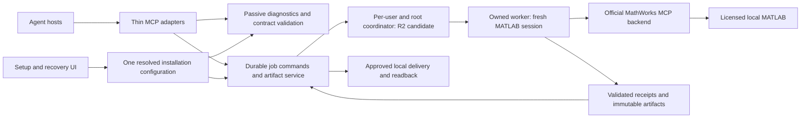

# Next technical route

Updated: 2026-09-16. **R1 has recorded acceptance. R2 is approved and in progress as the alpha.3 candidate; R3 has not started.**
Recorded R1 evidence is in [R1 reliability](R1_RELIABILITY.md); the current
implementation and acceptance ledger is [R2 durable jobs](R2_DURABLE_JOBS.md).

## Decision

The next release should make the existing five operations dependable in ordinary
installed use. Keep one host-neutral core, six public tools, the locked Python
environment and the accepted MathWorks backend. Reliability, recoverable jobs
and usable original-file delivery take priority over additional recipes or hosts.

The owner's latest approval authorizes **R2 implementation and verification**.
It does not authorize starting R3 or establish acceptance of another host, a shared
MATLAB service, an automatic dependency upgrade or a warm-session implementation.

## Baseline alpha before R1: what the evidence supported

The baseline runtime was `c5c73174f3507f5291df5fbcea28a67795ea0763`, packaged as
`0.1.0a1`. Icon assets, adapter metadata, local installation and planning records
do not change its calculation or recovery code.

| Area | Assessment |
| --- | --- |
| Scientific foundation | Useful bounded alpha: five operations, explicit methods/units, selected numerical fixtures, native MAT/FIG reopening and independent scripts. Six final-package cases passed on R2026a Update 5. |
| Installation today | Current-device installation, registered Codex command, enabled personal plugin, cached icon and Start-menu shortcut verified. A separate installed kinetics job produced seven files with local hash readback; independent analytic error was below `1e-8`. Visible wizard, fresh device and upgrade/removal are still separate gates. |
| Interruption today | The installation probe initially read a nested job response incorrectly and closed its client. The original dispatched job was preserved as unknown, with no native receipt or outputs observed. It was reconciled without replay; quarantine was cleared only after process-absence and lock/marker checks. The later kinetics job was a different operation, not a replay. |
| Model usability | Earlier full Terra max calibration/edit/delivery passed after 14 rejected calls and 66 calls overall. A later eight-call revision passed, but has a different scope. Today's installed MCP client is not a fresh host-model benchmark. |
| Routine-use readiness | Partial. The static review identifies diagnostic side effects, root inconsistency, an execution/quarantine ordering risk and misleading over-limit resource routing. These prevent a broader reliability claim. |

Evidence: [independent review](ALPHA_REVIEW_2026-09-15.md),
[installation](../verification/local-installation-2026-09-15.json),
[installed native case](../verification/local-installation-native-2026-09-15.json),
[interrupted probe](../verification/installation-probe-interruption-2026-09-15.json),
[release status](STATUS.md).

## Architecture direction

R1 established the recorded execution and diagnostic boundary. The R2 candidate
now implements this local coordinator topology; independent acceptance is still
in progress. It separates job ownership from an individual MCP client, without
a public network listener or database. Outer-host or operating-system termination
remains outside the client-disconnect guarantee.

## R1 — Repair the current execution and diagnostic boundaries

Implemented R1 scope: CLI/setup entrypoints, configuration propagation, core execution
transitions, backend identity and the existing resource response. Preserve the
scientific recipes and the public tool names.

1. **Passive diagnostics.** Construct a read-only status view without queue
   recovery or a worker. Make service startup recovery an explicit internal
   operation. A previously accepted, undispatched request may resume only under
   the documented service policy; `status`, `self-test` and setup checks cannot
   authorize that transition.
2. **One installation root.** Resolve configuration once and pass it through
   setup, connection, diagnostics, job store and `OfficialBackend`. An explicit
   `--root` must reach the GUI as well. Test two distinct roots with deliberately
   different installation paths and an unconfigured default root.
3. **Execution ownership and quarantine.** Commit the terminal or
   unknown/quarantined transition while still holding execution ownership.
   Another coordinator must not dispatch between lock release and quarantine
   publication. Record an instance UUID plus process creation identity, rather
   than relying on a PID that can be reused. Keep dispatch identity, MATLAB
   session identity and native-stop evidence separate.
4. **Truthful large-file routing.** If an artifact cannot be read through the
   advertised resource route, return the implemented approved-local-delivery
   choice. Keep the size/hash metadata. Do not return an unreadable link as an
   available alternative or invent a host attachment reference.

R1 acceptance is specific: persisted queued jobs remain untouched by all passive
entrypoints; two-coordinator fault injection cannot pass an unresolved execution;
crash/timeout/late-receipt cases do not replay a dispatch; custom roots stay
isolated; and both sides of the 16 MiB resource boundary report a usable route.
Run the native lifecycle case with an unrelated MATLAB session open and prove
that session was not attached to, altered or terminated. Portable tests alone
cannot close this native gate.

## R2 — Make installed jobs survive ordinary client behavior

**Approved on 2026-09-16; implementation and acceptance in progress.** Candidate
version: `0.1.0a3` / `0.1.0-alpha.3`. Publication and exact-package native,
installed-host, model and cloud results remain separate pending gates.

The candidate uses one on-demand coordinator per user and resolved installation
root, with thin stdio front ends and the existing file-based store. Windows uses
a current-user named-pipe ACL with remote clients rejected; Linux uses a private
Unix socket. Private bounded JSON RPC carries approved commands. A lifetime lock,
process creation identity, runtime version and configuration fingerprint prevent
silent takeover of a live owner by another runtime or configuration. Lost
responses do not automatically resend commands.

- A client disconnect abandons its wait, not ownership of the scientific job.
  A separate explicit cancel request changes the job's intent. Coordinator loss
  retains the R1 unknown/quarantine boundary for dispatched work. Reconnect with
  the same job ID and original idempotency key; never create a new write to
  repair a lost response.
- On Windows, supported process breakaway is required for automatic startup.
  If the host rejects it, report that failure without an ordinary-child fallback.
  The user can open the installed Setup normally and explicitly choose **Start
  job service**. That action may resume accepted, undispatched work; status and
  setup checks remain passive. Neither route promises survival after the outer
  host, its Job Object or the operating system terminates.
- Native session identity and exit are separate evidence. A backend return,
  absent response, terminal job label or idle service exit does not by itself
  prove MATLAB stopped. No new process-name-wide termination is introduced.
- Normal idle exit requires no in-flight handlers, worker futures or accepted
  active jobs. Scientific originals and unknown/quarantine evidence remain.
  Queue admission is bounded to ten active jobs. Passive status scans report
  logical bytes under the job store; if incomplete, retained job/byte counts are
  lower bounds and the active-job count is unknown. These observations are not
  quotas, an atomic filesystem snapshot or authority to delete files. Retention
  is `explicit_removal_only`, with no automatic cleanup and no job-removal action
  added by this increment.
- Use factual `job.phase` and durable monotonic `job.event_seq`. The phase
  `executing` includes backend/session startup; `validating` means receipt and
  artifact checking, not completed native verification. Older stored jobs may
  expose null phase and sequence zero without read-time migration writes.
- `matlab_job` action `wait` accepts `after_event_seq` from the same job and
  `timeout_seconds` from 0 to 10, default 5. A changed sequence, non-active state
  or deadline returns the current nested snapshot; a deadline is successful
  observation. This limit bounds core waiting after receipt, not startup or
  end-to-end host latency. At most four handlers wait concurrently; `WAIT_BUSY`
  permits status or a later wait. Waiting never cancels, reconciles or replays.
  Unknown totals stay unknown; no estimated percentages are reported.
- Keep result nesting and identifiers consistent across help, schemas, examples
  and installed smoke clients. The installation probe's parsing error is a
  concrete reason to validate consumers against the public envelope.

Gate: two installed clients can observe the same job; closing either client does
not lose execution ownership; restarting the coordinator never replays a
dispatched operation; cancellation, late completion and quarantine are distinct;
and idle shutdown leaves no unaccounted owned session.

## R3 — Complete the ordinary-user analysis and delivery workflow

**Not started; remains a proposal.** Keep native execution and delivery independently recoverable.

- Represent approved output folders by stable setup-selected identifiers for a
  proposed multi-file delivery action. Internally resolve full filenames from
  the immutable artifact manifest. Preserve the current single-file action for
  existing clients and version any semantic changes explicitly.
- Stage a copied file in the destination directory, verify its size/hash, then
  publish it atomically. Reuse identical completed files; preserve conflicting
  files. A transfer retry reuses existing bytes and never starts MATLAB.
- If the matched benchmark shows per-file calls remain a material bottleneck,
  add a bounded batch action under `matlab_artifacts`, with per-file outcomes
  and resumable transfer receipts. Avoid adding many overlapping public tools.
- Distinguish axis-label presentation from unit metadata. A unit change needs a
  defined numerical transformation and propagation to native data/scripts, or
  clarification/rejection. Unchanged curves alone cannot certify a unit change.
- Complete visible setup, reconnect, repeated installation, upgrade and removal
  on a second user/device. Preserve existing connections and research outputs.
  Keep the designed icon consistent across the plugin, installed entry and GUI.

Gate: an installed, projectless natural-language workflow performs the same
calibration, continued revision and original-file delivery as the benchmark,
with native reopening and destination readback. Record failures and human
corrections, not merely the final result. Exercise interrupted and conflicting
delivery separately. Validate fixed-zero/weighting/unit-edit scientific branches
before extending their acceptance claims.

## Protocol compatibility and backend policy

The design retains the accepted official backend **0.13.0** and Python SDK
**2.2.0** until a measured requirement justifies a change. Public host protocol
and private backend protocol are separate connections with separate negotiated
capabilities.

The [MCP 2026-07-28 changelog](https://modelcontextprotocol.io/specification/2026-07-28/changelog)
changes discovery and HTTP lifecycle and moves Tasks into an optional extension.
The [SDK 2.2.0 notes](https://github.com/modelcontextprotocol/python-sdk/blob/v2.2.0/docs/whats-new.md)
state that the new Tasks extension is not implemented there. Therefore the
existing `matlab_run`/`matlab_job` contract remains the first target; add an
extension adapter only after SDK and target-host support are demonstrated.
Test legacy and modern discovery independently, while preserving compact
structured output, server-side validation and matching JSON text fallback.

The complete source rationale is in [official-source notes](ROADMAP_SOURCE_NOTES_2026-09-15.md).
Do not implement private vendor connector RPCs or replace the official backend
merely because an alternative API exists.

## Later options, subject to separate evidence

**Warm MATLAB sessions:** only after R1/R2, with measured startup/compute/export
time and a tested reset boundary for variables, paths, working folder, figures,
random state and warnings. Compare the same workload; keep fresh sessions as
the default until isolation and material benefit are demonstrated.

**One additional host:** choose from actual user demand. First inspect its
connection, authentication and original-file receiving contract. Reuse the
same core; add only the missing adapter. A local MCP path is not a ChatGPT
attachment, and successful Codex use does not certify another host.

**Remote execution:** a later paired, single-user device-executor design with
revocation, offline/reconnect behavior, bounded transfer and verified receiver
references. It needs its own vendor/entitlement and host checks. A centralized
multi-user MATLAB service is outside this proposal.

**Additional science:** extend the existing five operations' scientific branch
coverage before choosing a new recipe. General evaluation, Live Editor/MLX,
Simulink and toolbox expansion are not in R1–R3.

## Measurement and release gates

Use GPT-5.6 Terra with max reasoning when actually available. Match input, goal,
required artifacts, host configuration and enabled plugins before comparing
results. Separate startup, computation, native verification, model/tool time,
copy time, peak memory and retained disk. Record actual input/cached/output/
reasoning counters; these do not by themselves establish a billed saving.

Each candidate keeps separate rows for source tests, installed runtime, native
science, native lifecycle, visible setup, model behavior, original-file receipt,
cloud development and release integrity. Publish an alpha only for the scopes
that passed; do not turn a repaired diagnostic or schema check into a stable
release claim. Retain the current package as the explicit rollback artifact.

**Current boundary:** the owner authorized R2 implementation and verification on
2026-09-16. Complete and report its exact candidate gates without inheriting
alpha.2 native, package, model or host results. R3 and later options remain
proposals and have not started.
